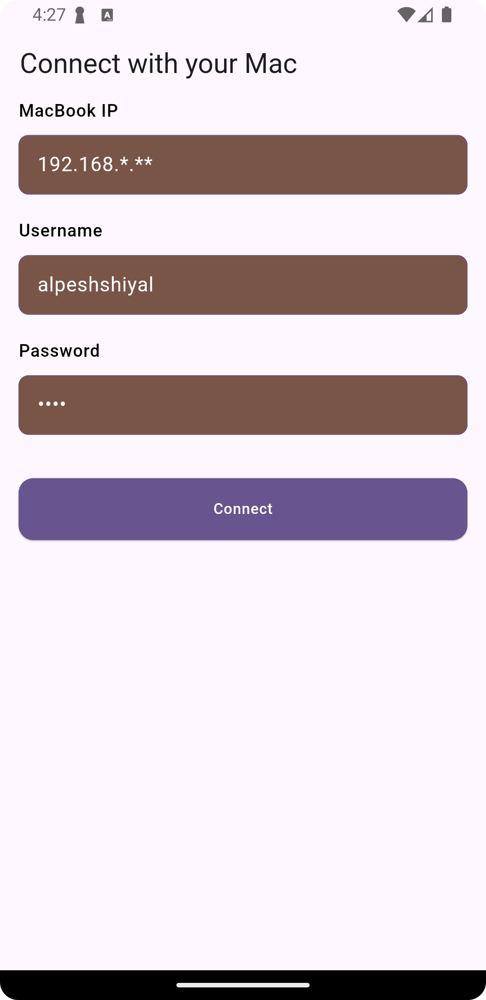
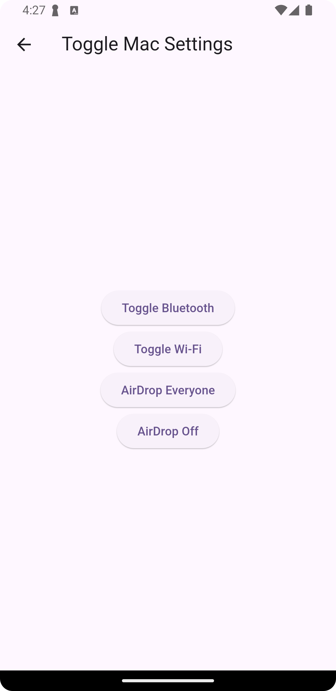

# 🖥️ mac_settings_flutter

`mac_settings_flutter` is a Flutter package that allows you to **remotely control macOS system settings**—such as **Wi-Fi**, **Bluetooth**, and **AirDrop**—directly from your Flutter app. It works by leveraging Apple Shortcuts to trigger macOS automation from your mobile device.

> 💤 **You can control these settings even while your Mac is in sleep mode** — as long as your Mac and mobile device are connected to the **same Wi-Fi network**.

---

## ✨ Features

- ✅ Toggle **Wi-Fi** on/off from your Flutter app
- ✅ Toggle **Bluetooth** on/off from your Flutter app
- ✅ Toggle **AirDrop** on/off from your Flutter app
- 🔐 Built using Apple Shortcuts for secure native control
- 💻 Seamless connection between your Mac and Flutter application
- 💤 Works even when your Mac is **in sleep mode**, if both devices are on the **same Wi-Fi network**

---

## Example Application Preview

<h3>App Screenshots</h3>

<p float="center">
  
  
</p>

## 🚀 Getting Started

Before using this package, make sure you meet the following prerequisites:

### 1. Install macOS Shortcuts

This package uses Apple Shortcuts to interface with macOS system settings.  
👉 You need to download and install the required shortcuts on your Mac.

**🔗 Download the required Shortcuts:**

- [Toggle Wi-Fi Shortcut](assets/toggle_wifi.shortcut)
- [Toggle Bluetooth Shortcut](assets/toggle_bluetooth.shortcut)
- [AirDrop Everyone Shortcut](assets/airdrop_everyone.shortcut)
- [Off AirDrop Shortcut](assets/airdrop_off.shortcut)

> Once installed, these shortcuts allow the Flutter app to trigger macOS-level changes securely and reliably.

---

## 📦 Installation

Add the following to your `pubspec.yaml`:

```yaml
dependencies:
  mac_settings_flutter: ^<latest-version>

```

## 🧑‍💻 Usage

### 1. Connect to your Mac

Use the following code to authenticate and establish a connection with your Mac using its IP address, username, and password:

```dart
final String macIp = ipController.text;
final String username = userController.text;
final String password = passwordController.text;

isLoading = true;
notifyListeners();

macSettingFlutter.onAuthenticated = () {
  Alerts.showInfoSnackBar("Authenticated successfully!");
  Navigator.of(context).pushNamed(ControlMacPage.routeName);
};

macSettingFlutter.printTrace = (value) {
  debugPrint("print trace: $value");
  Alerts.showInfoSnackBar(value);
};

// Connect to Mac
await macSettingFlutter.connectMac(
  ip: macIp,
  userName: username,
  macPassword: password,
);
```

### 2. Toggle Mac System Settings
Once connected, you can toggle Wi-Fi, Bluetooth, and AirDrop using the MacSettingsController:

```dart
import 'package:mac_settings_flutter/mac_settings_flutter.dart';

final controller = MacSettingsController();

// Toggle Wi-Fi
await controller.toggleWiFi();

// Toggle Bluetooth
await controller.toggleBluetooth();

// Toggle AirDrop
await controller.toggleAirDrop();

```